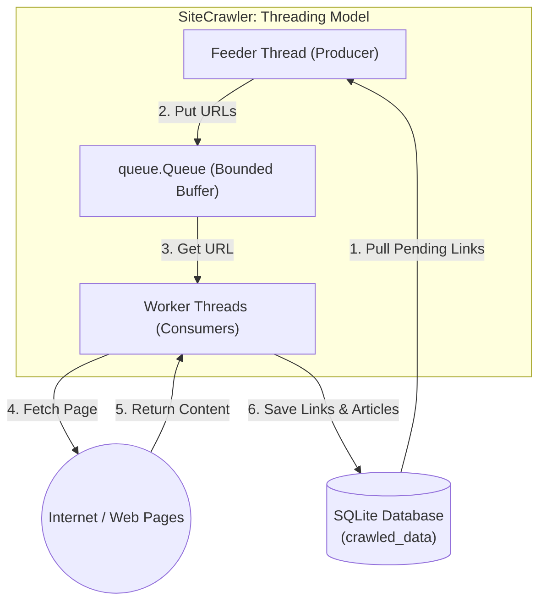

# Polite Web Crawler

A lightweight, polite web crawler written in Python that scrapes websites and stores raw page content along with extracted page/article metadata in a per-domain SQLite database. Built with `robots.txt` compliance, configurable crawl delays, exponential-backoff retries, SHA-256 duplicate detection, and resume support.

---

## Table of Contents

- [Features](#features)
- [Architecture](#architecture)
- [Requirements](#requirements)
- [Installation](#installation)
- [Usage](#usage)
  - [Command-line Arguments](#command-line-arguments)
  - [Examples](#examples)
- [PowerShell Helper Script](#powershell-helper-script)
- [Database Schema](#database-schema)
- [Project Structure](#project-structure)
- [Configuration](#configuration)
- [Logging](#logging)
- [Graceful Shutdown](#graceful-shutdown)
- [Known Limitations & Future Work](#known-limitations--future-work)
- [License](#license)

---

## Features

- **robots.txt compliance** — respects `Disallow` rules and honours the `Crawl-delay` directive.
- **Configurable crawl delay** — defaults to 30 s; overridden by `robots.txt` if its value is higher.
- **Concurrent crawling (multi-threading)** — support for parallel worker threads via a thread pool (`--workers`) with safety locks.
- **Auto-scaled rate-limiting** — automatically scales individual worker delays to keep the overall request rate to the server safe and unchanged.
- **Resume support** — loads `pending` links from an existing SQLite database so interrupted runs can continue.
- **Re-crawl window** — skips pages crawled within a configurable time window (default: 3 hours) to avoid hammering the same URL.
- **Duplicate detection** — optional SHA-256 content-hash check prevents storing identical pages more than once. Deduplication is enforced at the database level via a `UNIQUE` index on `content_hash`, so it persists across resumed runs.
- **Binary content handling** — non-text responses (images, PDFs, etc.) are stored Base64-encoded.
- **Retry with exponential backoff** — up to 3 retries on timeouts and 504 Gateway Timeout errors.
- **Domain-scoped crawl** — only follows links that share the same `netloc` as the seed URL.
- **Structured logging** — timestamped log files per domain, written with UTF-8 encoding. Each site gets its own isolated logger in parallel mode — no cross-contamination between log files.
- **Per-site proxy & Tor support** — configure separate HTTP, HTTPS, or SOCKS5 proxies per site, with a built-in `"tor"` shortcut to route requests through a local Tor client.
- **Graceful shutdown** — press `Ctrl+C` once to finish in-flight pages and exit cleanly; press again to force-quit immediately.

---

## Architecture

```
crawler_app.py        ← entry point / orchestration
  ├── config.py       ← global constants (User-Agent string)
  ├── utils.py        ← HTTP fetching, link extraction, hashing, filesystem helpers
  ├── proxies.py      ← connection proxy provider classes and factory
  ├── processors.py   ← decoupled page processors strategy pipeline
  └── database.py     ← SQLite schema, CRUD operations
scripts/
  └── crawl-links.ps1 ← PowerShell launcher for parallel multi-site crawls
```

The crawler implements a continuous **Producer-Consumer Threading model** to optimize network throughput and decouple database read operations from network fetching:


```text
                  [ SQLite Database ]
                      ▲           │
       (6. Save Links)│           │ (1. Pull Pending Links)
                      │           ▼
               ┌──────┴───────────┴──────────┐
               │       SiteCrawler           │
               │                             │
               │   ┌─────────────────────┐   │
               │   │    Feeder Thread    │   │
               │   │     (Producer)      │   │
               │   └──────────┬──────────┘   │
               │              │              │
               │              │ (2. Put URL) │
               │              ▼              │
               │   ┌─────────────────────┐   │
               │   │     queue.Queue     │   │
               │   │  (Bounded Buffer)   │   │
               │   └──────────┬──────────┘   │
               │              │              │
               │              │ (3. Get URL) │
               │              ▼              │
               │   ┌─────────────────────┐   │
               │   │   Worker Threads    │   │
               │   │     (Consumers)     │   │
               │   └──────────┬──────────┘   │
               └──────────────┼──────────────┘
                              │ (4. Fetch Page)
                              ▼
                      [ Internet Pages ]
```


1. **Feeder Thread (Producer)**: Continuously queries SQLite for pending links (using the CLI configured batch limit) and feeds them into a thread-safe bounded queue (`queue.Queue`). To prevent duplication, URLs currently queued or in-flight are tracked in an in-memory set under a thread lock.
2. **Worker Threads (Consumers)**: A pool of persistent worker threads runs in a `ThreadPoolExecutor`. They continuously pull URLs from the queue, execute fetch requests, process page parsing via Strategy Extractors, extract same-domain links, and persist results to SQLite (which automatically wakes up the feeder thread to queue newly discovered pages).
3. **Crawl Termination**: When no pending URLs remain in SQLite, and all worker threads are idle, the feeder thread sets the shutdown event, terminating worker loops cleanly.

---

## Requirements

- Python 3.10+
- [requests](https://pypi.org/project/requests/)
- [beautifulsoup4](https://pypi.org/project/beautifulsoup4/)
- [certifi](https://pypi.org/project/certifi/)
- [trafilatura](https://pypi.org/project/trafilatura/) (≥ 1.8.0) — article text extraction & boilerplate removal
- [newspaper3k](https://pypi.org/project/newspaper3k/) (≥ 0.2.8) — news article scraping (title, authors, date, keywords)
- [PySocks](https://pypi.org/project/PySocks/) (≥ 1.7.1) — SOCKS proxy support for requests (used for Tor)

Standard-library modules used: `sqlite3`, `hashlib`, `argparse`, `logging`, `signal`, `urllib`, `base64`, `datetime`, `os`, `time`, `json`, `threading`.

---

## Installation

```bash
# Clone the repository
git clone https://github.com/svagionitis/crawler.git
cd crawler

# Create and activate a virtual environment (recommended)
python -m venv .venv
# Windows
.venv\Scripts\activate
# macOS / Linux
source .venv/bin/activate

# Install dependencies using the requirements file
pip install -r requirements.txt
```

---

## Usage

```bash
# Crawl a single website
python crawler_app.py --url <URL> [OPTIONS]

# Crawl multiple websites in parallel using a JSON configuration file
python crawler_app.py --config <PATH_TO_JSON> [OPTIONS]
```

### Command-line Arguments

| Argument | Type | Default | Description |
|---|---|---|---|
| `--url` | `str` | `None` | Seed URL to start crawling from (required unless `--config` is specified). |
| `--config` | `str` | `None` | Path to a JSON configuration file containing target URLs and site-specific options (array of objects format). |
| `--respect-robots` | flag | `False` | Honour `robots.txt` disallow rules and crawl-delay. |
| `--no-duplicates` | flag | `False` | Skip pages whose SHA-256 hash was already seen in this session. |
| `--crawl-delay` | `int` | `30` | Seconds to wait between requests. Overridden upward by `robots.txt`. |
| `--resume` | flag | `False` | Resume from an existing database (loads all `pending` links). |
| `--re-crawl-time` | `int` | `3` | Hours that must elapse before a URL is eligible for re-crawl. |
| `--logs-dir` | `str` | `logs` | Directory for log files (created if absent). |
| `--db-dir` | `str` | `db` | Directory for SQLite databases (created if absent). |
| `--batch-size` | `int` | `100` | Pending URLs fetched from the DB per batch. Tune down for low-memory hosts, up for resume runs on large DBs. |
| `--workers` | `int` | `1` | Number of parallel worker threads. The crawl delay is automatically scaled by this factor to maintain the aggregate request rate to the server, and forced to 1 if a `robots.txt` crawl delay is applied. |
| `--parser` | `str` | `auto` | Parsing engine for content & text extraction (`auto`, `newspaper`, `trafilatura`, `bs4`). |
| `--no-normalize-whitespace` | flag | `False` | Preserve raw whitespaces (newlines, tabs) in the extracted text instead of collapsing them into a single space. |
| `--plagiarism-db` | `str` | `db/plagiarism_index.db` | Path to the central similarity index SQLite database. |
| `--plagiarism-threshold` | `float` | `0.8` | Similarity Jaccard threshold (0.0 to 1.0) above which articles are flagged as plagiarism/near-duplicates. |
| `--proxy` | `str` | `None` | Proxy configuration for the connection (e.g. `'tor'` or SOCKS/HTTP proxy URL). Defaults to a direct connection (explicitly overriding environment proxies). |
| `--keep-alive` | `bool` | `None` | Enable/disable HTTP Keep-Alive connection pooling (`true`/`false`). Defaults to `None` (which enables it for direct connections and disables it for proxy connections). |
| `--processor` | `str` | `news` | Content extraction processor strategy (`'news'`). |


### Crawling Multiple URLs via JSON Configuration

Instead of crawling a single site via `--url`, you can provide a JSON file containing target site configurations using `--config`. All sites in the file are crawled **in parallel** — each site runs in its own thread, with its own database and log file.

The configuration file supports two formats:

#### 1. Metadata Object Format (Recommended for Plagiarism/Similarity Checks)
This format defines global plagiarism settings at the top level, applying them uniformly to all sites inside the `sites` array:

```json
{
  "plagiarism_db": "F:\\db\\plagiarism_index.db",
  "plagiarism_threshold": 0.8,
  "sites": [
    {
      "url": "https://news.ycombinator.com",
      "respect_robots": true,
      "crawl_delay": 5,
      "re_crawl_time": 8
    },
    {
      "url": "https://www.tovima.gr",
      "respect_robots": true,
      "crawl_delay": 15,
      "re_crawl_time": 24,
      "proxy": "tor"
    }
  ]
}
```

#### 2. Plain List Format
A simplified format consisting of a plain JSON array of site objects:

```json
[
  {
    "url": "https://news.ycombinator.com",
    "respect_robots": true,
    "crawl_delay": 5,
    "re_crawl_time": 8
  },
  {
    "url": "https://www.tovima.gr",
    "respect_robots": true,
    "crawl_delay": 15,
    "re_crawl_time": 24
  }
]
```

#### Option Merging & Fallbacks
Any site-specific settings omitted from a site's JSON block will automatically fall back to the CLI arguments supplied on execution (or standard CLI defaults). For example, running:

```bash
python crawler_app.py --config config.json --db-dir F:\db --logs-dir F:\logs
```

will apply `F:\db` and `F:\logs` as the database and logs directory settings for all sites in `config.json` except those that specify their own local `db_dir` or `logs_dir` fields.

If no proxy is specified (locally in the JSON config or via the CLI `--proxy` parameter), the crawler defaults to a direct connection, which explicitly overrides and bypasses system environment proxy variables (like `HTTP_PROXY` and `HTTPS_PROXY`).

#### Hybrid Connection Strategy
To optimize performance and resource utilization, the crawler implements a hybrid connection strategy:
- **Direct Connection**: Utilizes a persistent `requests.Session()` to enable HTTP Keep-Alive connection pooling. This significantly reduces latency and local/remote socket overhead, speeding up crawls by up to 3x–5x.
- **Proxy/Tor Connection**: Disables session pooling and opens a fresh TCP/TLS socket per request (using `requests.get()`). This allows proxy services to successfully perform IP rotation and ensures Tor circuit changes apply to individual fetches.

This behavior can be explicitly overridden by specifying the `--keep-alive <true|false>` parameter on the command line or by configuring `"keep_alive": true/false` per site in the JSON configuration file. By default, keep-alive is enabled for direct connections and disabled for proxy connections.

### Multi-threading & Rate Limiting

To increase throughput without overloading target servers, the crawler supports concurrent crawling via `--workers`:
- **Auto-scaled Delay**: If you specify `--workers N` and a `--crawl-delay D`, the crawler automatically scales the delay for each individual worker to `D * N` seconds. This ensures that the overall request frequency hitting the server remains 1 request every `D` seconds on average.
- **robots.txt Safety**: If a site's `robots.txt` specifies a `Crawl-delay` and you run with `--respect-robots`, the crawler forces `--workers` to `1`. This is done to strictly honor the site's crawling policies and prevent parallel request bursts.

### Content Parsing & Text Extraction

For downstream text similarity, plagiarism checking, or general news analysis, the crawler extracts structured data from crawled HTML files:
- **Extracted Fields**:
  - `extracted_title`: The article headline.
  - `extracted_text`: Clean body text with boilerplate (headers, footer, ads, navigation menus) removed.
  - `extracted_authors`: Comma-separated list of article authors.
  - `extracted_date`: Publication date in ISO format or raw string.
  - `extracted_keywords`: Comma-separated list of keywords.
  - `parser_used`: The engine that actually performed the extraction (`newspaper`, `trafilatura`, or `bs4`). Reflects the real engine even when `--parser auto` fell back to a secondary option or when the primary engine raised an exception.
- **Parser Engines**:
  - `newspaper`: Uses the `newspaper3k` package (best for full news metadata, authorship, and NLP keywords).
  - `trafilatura`: Uses the `trafilatura` library (highly accurate text extraction and boilerplate cleaning).
  - `bs4`: Standard BeautifulSoup cleaning fallback (removes `<script>`, `<style>`, `<nav>`, `<footer>`, etc., and retrieves `<p>` blocks).
  - `auto` (Default): Attempts to use `newspaper` first, falls back to `trafilatura` if unavailable, and uses `bs4` if neither is installed.


**Basic crawl (no robots.txt, 30 s delay):**
```bash
python crawler_app.py --url https://www.example.com
```

**Parallel multi-site crawl using a JSON configuration:**
```bash
python crawler_app.py --config config.json --db-dir F:\db --logs-dir F:\logs
```

**Polite crawl with resume and duplicate filtering:**
```bash
python crawler_app.py \
  --url https://www.kathimerini.gr \
  --respect-robots \
  --no-duplicates \
  --crawl-delay 15 \
  --resume \
  --re-crawl-time 24 \
  --logs-dir C:\logs \
  --db-dir C:\db
```

**Multi-threaded crawl with 4 workers (auto-scales 15 s delay to 60 s per worker thread to maintain 15 s server rate):**
```bash
python crawler_app.py \
  --url https://www.kathimerini.gr \
  --workers 4 \
  --crawl-delay 15
```

**Re-crawl the same site weekly (168 h window):**
```bash
python crawler_app.py \
  --url https://cr.yp.to \
  --crawl-delay 30 \
  --resume \
  --re-crawl-time 168
```

---

## PowerShell Helper Scripts

There are two PowerShell scripts available in the `scripts/` directory:

### Hardcoded Launcher (Parallel)

`scripts/crawl-links.ps1` launches parallel crawls for a hardcoded set of sites, opening each in a separate maximized PowerShell window:

```powershell
# Run from the project root
.\scripts\crawl-links.ps1
```

Each window's title bar shows the URL being crawled. Sites currently configured include:

| Outlet | Crawl Delay | Re-crawl Window |
|---|---|---|
| tovima.gr, tanea.gr, protothema.gr, … | 15 s | 24 h |
| rizospastis.gr | 30 s | 24 h |
| bbc.com, theguardian.com, aljazeera.com | 30 s | 24 h |
| cr.yp.to, labtestsonline.org.uk | 30 s | 168 h (weekly) |
| news.ycombinator.com | 0 s (robots.txt) | 8 h |

### Config-driven Launcher (Parallel)

`scripts/crawl-by-config.ps1` passes a JSON configuration file directly to `crawler_app.py --config`, which crawls **all sites in parallel** in the current console session. It defaults to `config/news-sites-gr.json` but accepts any config file via the `-ConfigPath` parameter:

```powershell
# Run using the default configuration (config/news-sites-gr.json)
.\scripts\crawl-by-config.ps1

# Run using a custom configuration file
.\scripts\crawl-by-config.ps1 -ConfigPath config/sites.json
```

> **Tip:** Edit `config/news-sites-gr.json` or `config/sites.json` to add or remove sites, and use `crawl-by-config.ps1` to run crawls dynamically based on those files.

---

## Database Schema

Each domain gets its own SQLite file named `crawled_data_<domain>.db` inside `--db-dir`. The database uses Write-Ahead Log (WAL) mode (`PRAGMA journal_mode=WAL`) to support concurrent writes from multiple worker threads without locking.

```sql
-- Core queue table (domain-agnostic queue manager)
CREATE TABLE crawled_data (
    id                 INTEGER  PRIMARY KEY AUTOINCREMENT,
    domain             TEXT     NOT NULL,
    date_inserted      DATETIME NOT NULL,   -- when the link was first discovered / last updated
    date_crawled       DATETIME,            -- when the page was last successfully fetched
    link               TEXT     NOT NULL,
    content            TEXT,                -- HTML (text) or Base64 (binary)
    content_hash       TEXT,                -- SHA-256 of content; also stored on fetch errors
    status             TEXT     NOT NULL    -- 'pending' | 'crawled'
                       CHECK(status IN ('pending', 'crawled'))
);

-- News payload table (news domain strategy specific)
CREATE TABLE news_articles (
    link               TEXT     PRIMARY KEY, -- references crawled_data(link)
    extracted_title    TEXT,                 -- article headline
    extracted_text     TEXT,                 -- clean body text (boilerplate removed)
    extracted_authors  TEXT,                 -- comma-separated author list
    extracted_date     TEXT,                 -- publication date (ISO format or raw string)
    extracted_keywords TEXT,                 -- comma-separated keywords
    parser_used        TEXT,                 -- engine that ran the extraction ('newspaper', 'trafilatura', 'bs4', or NULL)
    FOREIGN KEY(link) REFERENCES crawled_data(link) ON DELETE CASCADE
);

-- Supermarket payload table (supermarket domain strategy specific)
CREATE TABLE supermarket_products (
    link               TEXT     PRIMARY KEY, -- references crawled_data(link)
    product_name       TEXT,                 -- product name
    price              REAL,                 -- price value
    sku                TEXT,                 -- SKU code
    category           TEXT,                 -- product category
    FOREIGN KEY(link) REFERENCES crawled_data(link) ON DELETE CASCADE
);

-- Forum payload table (forum domain strategy specific)
CREATE TABLE forum_posts (
    link               TEXT     PRIMARY KEY, -- references crawled_data(link)
    thread_title       TEXT,                 -- thread title
    author             TEXT,                 -- post author name
    post_content       TEXT,                 -- text body of the post
    post_date          TEXT,                 -- date post was published
    FOREIGN KEY(link) REFERENCES crawled_data(link) ON DELETE CASCADE
);

-- Indexes for fast queue queries and uniqueness constraint
CREATE UNIQUE INDEX idx_link          ON crawled_data (link);
CREATE INDEX        idx_status        ON crawled_data (status);
CREATE INDEX        idx_link_status   ON crawled_data (link, status);
-- Unique index for DB-level duplicate detection (NULLs are exempt)
CREATE UNIQUE INDEX idx_content_hash  ON crawled_data (content_hash);
```

> **Migration note for existing databases**
>
> When the crawler starts against a database created before these changes:
> 1. `init_db` automatically detects if `idx_link` is a regular index. If so, it deduplicates the table (keeping the oldest record per link), drops the old index, and recreates `idx_link` as a `UNIQUE` index. This is required to support the high-performance single-roundtrip `UPSERT` operations.
> 2. `init_db` detects whether `idx_content_hash` is present. If missing, it removes duplicate content hashes (keeping the oldest record per hash) and creates the unique index.
>
> No manual intervention is required — these migrations run once on the first startup and are completely transparent.


**Status lifecycle:**

```
discovered → pending
fetched ok → crawled
fetch error → pending  (retried on next run)
re-crawl skipped → pending (date_inserted refreshed)
```

---

## Project Structure

```
.
├── crawler_app.py          # Main entry point and crawl orchestration (SiteCrawler)
├── config.py               # Centralized CrawlerConfig dataclass containing default crawler settings
├── database.py             # SQLite helpers (init, save, update, load, check, thread-local cache)
├── extractors.py           # News article content extractors (Strategy Pattern: Newspaper, Trafilatura, BS4)
├── proxies.py              # Extensible proxy provider strategies and factory function
├── processors.py           # Decoupled page content processors (Strategy Pattern: NewsContentProcessor)
├── utils.py                # HTTP fetch, link extraction, hashing, directory utils
├── requirements.txt        # Python dependencies
├── config/
│   ├── news-sites-gr.json  # Example multi-site crawl configuration (Greek news outlets)
│   └── sites.json          # Alternative/extended site configuration
├── scripts/
│   ├── crawl-links.ps1     # PowerShell multi-site launcher (one window per site)
│   └── crawl-by-config.ps1 # PowerShell config-driven launcher (single process)
├── test-page.htm           # Sample HTML page for offline testing
├── .editorconfig           # Editor formatting rules (4-space indent, UTF-8)
├── .gitignore              # Standard Python gitignore
└── README.md
```

---

## Configuration

Default crawler configurations reside in the `CrawlerConfig` dataclass in [`config.py`](config.py):

```python
@dataclass
class CrawlerConfig:
    respect_robots: bool = True
    no_duplicates: bool = True
    crawl_delay: int = 30
    resume: bool = False
    re_crawl_time: float = 3.0
    ...
    user_agent: str = "Crawler/1.0 (+https://example.com/crawler)"
```

Modify the field defaults inside `CrawlerConfig` to change global fallback settings (such as the default `user_agent` to identify your crawler in server access logs and to `robots.txt` parsers).

---

## Logging

A new log file is created per run, named:

```
<logs-dir>/crawler_<domain>_<YYYYMMDDHHMMSS>.log
```

Each site gets its own **named logger** (`crawler.<domain>`), so when crawling multiple sites in parallel via `--config`, each site's log output is written to a **separate file** with no cross-contamination. Log entries are written both to the file and to the console (`StreamHandler`) at `INFO` level. UTF-8 encoding is enforced on the file handler to support Greek characters.

Example log output:
```
2024-10-15 14:30:22,001 - INFO - Crawling: https://www.kathimerini.gr/
2024-10-15 14:30:22,543 - INFO - Saved link to database: https://www.kathimerini.gr/politics/ (status: pending)
2024-10-15 14:30:22,544 - INFO - Waiting for 15 seconds before the next request...
```

---

## Graceful Shutdown

The crawler supports graceful shutdown via `Ctrl+C` (SIGINT):

| Action | Behaviour |
|---|---|
| **First `Ctrl+C`** | Sets a shutdown flag. Workers finish their **current in-flight page**, skip remaining queued URLs, and exit cleanly. A log message confirms: *"Shutdown requested. Crawl stopped gracefully."* |
| **Second `Ctrl+C`** | Restores the default signal handler and exits immediately (hard kill). |

This works for both `--url` (single site) and `--config` (parallel multi-site) modes. Since `crawl-by-config.ps1` runs `python.exe` directly, `Ctrl+C` in the PowerShell window propagates to the Python process automatically.

Pending links remain in the database with `status = 'pending'`, so you can resume with `--resume` after a graceful stop.

---

## Known Limitations & Future Work

- **Dynamic / JavaScript-Rendered Sites** — The crawler currently performs static HTTP requests. Sites that rely on client-side JavaScript framework rendering (React, Vue, etc.) or load articles dynamically will not have their text contents fully captured. Incorporating a headless browser rendering engine (such as Playwright, Selenium, or Pyppeteer) is a planned feature to handle dynamic web content.
- **Plagiarism & Duplicate Content Detection** — To check if news reports are plagiarized or cover identical stories, extracted article texts can be compared using natural language processing (NLP) and similarity algorithms (such as MinHash/LSH, Cosine Similarity via TF-IDF or word/document embeddings, and sequence alignment).
- **Link extraction limited to `<a href>`** — `<link>`, `<script src>`, sitemaps, and RSS feeds are not followed.

---

## Development

### Pre-commit Hooks

This project uses `pre-commit` to maintain code formatting, PEP 8 style conventions, and quality standards automatically before every git commit.

#### Setup

You can install the dependencies either using `pyproject.toml` (recommended) or via the legacy `requirements.txt` files.

##### Option A: Using `pyproject.toml` (Recommended)

To install the project in editable mode (`-e`) along with its core dependencies:
```bash
pip install -e .
```

To install the project with dynamic JavaScript browser rendering support:
```bash
pip install -e .[js]
```

To install all dependencies including development tools (like `pre-commit`):
```bash
pip install -e .[js,dev]
```

##### Option B: Using legacy requirements files

1. Install the core dependencies:
   ```bash
   pip install -r requirements.txt
   ```
   *(Optional)* Install the dynamic browser rendering dependencies:
   ```bash
   pip install -r requirements-js.txt
   ```

2. Install git hook scripts:
   ```bash
   pre-commit install
   ```

Now, every time you commit code, it will automatically run trailing whitespace checks, EOF fixes, YAML syntax validation, and **Ruff** formatting/linting checks.

To run the checks manually against all files:
```bash
pre-commit run --all-files
```

---

## License

This project is dual-licensed:
- **Open Source**: GNU General Public License version 3 (GPLv3).
- **Commercial**: For use in commercial, proprietary, or closed-source applications.

See the [LICENSE](LICENSE) file for details.
