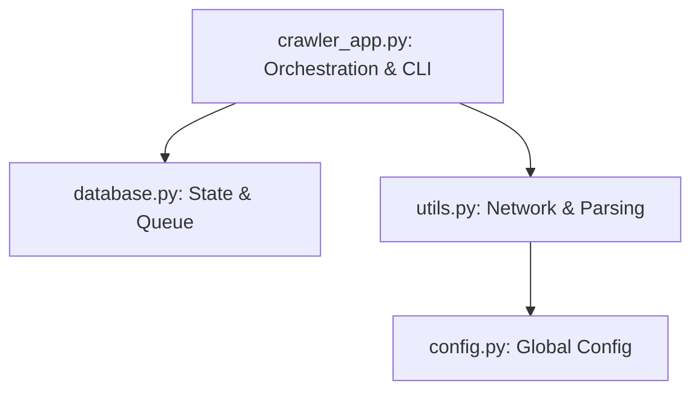

# Architectural Review: Greek News Scraper & Crawler

This document analyzes the architecture of the news crawler from a Senior Python Software Engineer perspective. It evaluates the current component division, concurrency model, data flow, and proposes a path toward a more maintainable, testable, and scalable codebase.

---

## 🏛️ Current Architectural Snapshot

The application is structured into four main modules:



### Module Roles
1. **`crawler_app.py`**: Handles CLI arguments, site configuration loading, parallel site orchestration, signals (SIGINT/Ctrl+C), and the core BFS thread-pool loop.
2. **`database.py`**: Manages SQLite schemas, thread-local connection pooling, database-level migrations, deduplication constraints, and BFS queue operations (`load_pending_links`, `save_links_to_db`).
3. **`utils.py`**: Implements networking (`requests`), link discovery, hashing, and parsing strategy (newspaper, trafilatura, bs4 fallback).
4. **`config.py`**: Shared static configuration (e.g., `USER_AGENT`).

---

## 🔍 Structural Analysis

### 1. Separation of Concerns (SoC)
* **Strengths**: The code separates DB queries from network fetching. The dependencies flow downwards: `crawler_app` -> `database` & `utils` -> `config`.
* **Weaknesses**: The database module is doing too much. It does not just perform CRUD; it enforces queue scheduling and re-crawl logic. The application logic is highly coupled to SQL implementations (SQLite-specific queries like `julianday('now')` are mixed into the query methods).

### 2. State & Queue Management
* **Design**: The queue is fully database-backed, which provides excellent durability (safe to interrupt and resume at any point).
* **Limitation**: The DB state is queried in batches (`batch_size`), and the thread pool is recreated for each batch. This creates a hard synchronization boundary between batches. If one thread encounters a slow page, all other threads sit idle waiting for the batch executor to close before loading the next batch.

### 3. Strategy Pattern in Text Extractors
* **Design**: Standard conditional logic in `extract_article_content` routes HTML to the chosen parser library.
* **Limitation**: Adding a new parser requires editing `utils.py`, adding conditional imports, and updating long nested `try-except` chains. It violates the **Open-Closed Principle (OCP)**.

### 4. Class-Based Encapsulation vs. Functions
* **Design**: The codebase is 100% procedural (pure functions).
* **Limitation**: State (like `database_name`, `robots_parser`, `logger`, `re_crawl_time`) must be passed down through every function call chain. This leads to "parameter drilling" (e.g., `crawl_worker` takes 9 arguments).

---

## 🛠️ Proposed Architectural Upgrades

To move the crawler into a production-grade library/service framework, we recommend the following structural refactorings:

### Recommendation A: Introduce a `BaseExtractor` (Strategy Pattern)
Abstract the text parsing libraries behind a standard interface. This makes adding/removing extractors trivial and improves unit testability by allowing parser mock injections.

```python
from abc import ABC, abstractmethod

class BaseExtractor(ABC):
    @abstractmethod
    def extract(self, html_content: str, url: str) -> dict:
        pass

class NewspaperExtractor(BaseExtractor):
    def extract(self, html_content: str, url: str) -> dict:
        # newspaper3k implementation
        pass
```

### Recommendation B: Class-Based Encapsulation (`SiteCrawler`)
Encapsulate the state of a single domain crawl inside a class context. This eliminates parameter drilling.

```python
class SiteCrawler:
    def __init__(self, start_url, config, db_manager, logger):
        self.start_url = start_url
        self.config = config
        self.db = db_manager
        self.logger = logger
        self.robots_parser = None
        
    def crawl(self):
        # core BFS loop
```

### Recommendation C: Producer-Consumer Queue Model
Instead of recreating the `ThreadPoolExecutor` for every database batch (which causes worker thread thrashing and idle-waiting periods), use a persistent worker thread pool feeding from a thread-safe `queue.Queue`.
A single background thread can feed pages from SQLite into the `queue.Queue`, while worker threads consume from it continuously.

```
[SQLite DB] --> (Feeder Thread) --> [queue.Queue] --> [Worker Thread 1]
                                                  --> [Worker Thread 2]
```

---

## 📈 Architecture Maturity Scorecard

| Area | Rating | Senior Review Notes |
|---|---|---|
| **Durability** | ⭐⭐⭐⭐⭐ (5/5) | DB-backed queue and unique indexing are exceptionally robust against crashes. |
| **Performance** | ⭐⭐⭐⭐☆ (4/5) | Thread-local pooling and merged SQL queries minimized I/O bottlenecks. |
| **Extensibility** | ⭐⭐⭐☆☆ (3/5) | Adding new parser engines or queue backends requires modifying internal functions. |
| **Testability** | ⭐⭐⭐☆☆ (3/5) | Hard-coded imports and SQL make unit testing dependent on SQLite file mocks. |
