# C4 Model - Level 4: Code Diagram

The Code diagram details class layouts, inheritance structures, and interface relations inside the codebase.

## UML Class Diagram (ASCII)

```text
               +--------------------------------------+
               |             SiteCrawler              |
               |--------------------------------------|
               | - start_url: str                     |
               | - config: CrawlerConfig              |
               | - session: Session                   |
               | - proxy_provider: ProxyProvider      |
               | - processor: ContentProcessor        |
               | - indexer: SimilarityIndexer         |
               +------------------+-------------------+
                                  | Composition
            +---------------------+---------------------+
            |                     |                     |
            v                     v                     v
 +--------------------+ +--------------------+ +--------------------+
 |   CrawlerConfig    | |   ProxyProvider    | |  ContentProcessor  |
 |--------------------| |--------------------| |--------------------|
 | respect_robots     | | <<interface>>      | | <<interface>>      |
 | crawl_delay        | | +get_proxies()     | | +process_page()    |
 | js_rendering       | +---------+----------+ +---------+----------+
 | js_driver          |           |                      |
 | auto_detect_js     |           | Implements           | Implements
 | ...                |           v                      v
 +--------------------+ +---------+----------+ +---------+----------+
                        |  DirectConnection  | |  ContentProcessor  |
                        |      Provider      | |   Implementations  |
                        +--------------------+ | (News, Supermarket,|
                                  ^            |  Forum Processors) |
                                  | Inherits   +--------------------+
                        +---------+----------+
                        |  StaticProxy-      |
                        |  Provider          |
                        +--------------------+
                                  ^
                                  | Inherits
                        +---------+----------+
                        |  TorProxyProvider  |
                        +--------------------+
```

## UML Class Diagram (Mermaid)

```mermaid
classDiagram
    class SiteCrawler {
        +start_url: str
        +config: CrawlerConfig
        +session: requests.Session
        +proxy_provider: ProxyProvider
        +processor: ContentProcessor
        +indexer: SimilarityIndexer
        +initialize()
        +prepare_queue()
        +crawl()
        +crawl_page(url)
    }

    class CrawlerConfig {
        +respect_robots: bool
        +no_duplicates: bool
        +crawl_delay: int
        +resume: bool
        +re_crawl_time: float
        +logs_dir: str
        +db_dir: str
        +batch_size: int
        +workers: int
        +parser_engine: str
        +normalize_whitespace: bool
        +plagiarism_db: str
        +plagiarism_threshold: float
        +proxy: str
        +keep_alive: bool
        +user_agent: str
        +processor: str
        +js_rendering: bool
        +js_driver: str
        +auto_detect_js: bool
        +from_args(args)
        +merge_with_dict(site_dict)
    }

    class ProxyProvider {
        <<interface>>
        +get_proxies() dict
    }
    class DirectConnectionProvider {
        +get_proxies() dict
    }
    class StaticProxyProvider {
        +proxy_url: str
        +get_proxies() dict
    }
    class TorProxyProvider {
        +get_proxies() dict
    }

    ProxyProvider <|-- DirectConnectionProvider
    ProxyProvider <|-- StaticProxyProvider
    StaticProxyProvider <|-- TorProxyProvider

    class BaseExtractor {
        <<interface>>
        +name() str
        +is_available() bool
        +extract(html, url, soup) dict
    }
    class NewspaperExtractor {
        +extract(html, url, soup) dict
    }
    class TrafilaturaExtractor {
        +extract(html, url, soup) dict
    }
    class BS4Extractor {
        +extract(html, url, soup) dict
    }

    BaseExtractor <|-- NewspaperExtractor
    BaseExtractor <|-- TrafilaturaExtractor
    BaseExtractor <|-- BS4Extractor

    class BaseSiteExtractor {
        <<interface>>
        +_VALID_URL: str
        +suitable(url) bool
        +name() str
        +extract(html, url, soup, parser_engine, normalize_whitespace) dict
    }
    class GenericExtractor {
        +extract(html, url, soup, parser_engine, normalize_whitespace) dict
    }
    class KathimeriniGrExtractor {
        +extract(html, url, soup, parser_engine, normalize_whitespace) dict
    }
    class TovimaGrExtractor {
        +extract(html, url, soup, parser_engine, normalize_whitespace) dict
    }

    BaseSiteExtractor <|-- GenericExtractor
    BaseSiteExtractor <|-- KathimeriniGrExtractor
    BaseSiteExtractor <|-- TovimaGrExtractor

    class ContentProcessor {
        <<interface>>
        +process_page(crawler, url, content, content_type)
    }
    class NewsContentProcessor {
        +process_page(crawler, url, content, content_type)
    }
    class SupermarketContentProcessor {
        +process_page(crawler, url, content, content_type)
    }
    class ForumContentProcessor {
        +process_page(crawler, url, content, content_type)
    }

    ContentProcessor <|-- NewsContentProcessor
    ContentProcessor <|-- SupermarketContentProcessor
    ContentProcessor <|-- ForumContentProcessor

    class SimilarityIndexer {
        +db_path: str
        +logger: Logger
        +add_signature(link, signature)
        +find_similar_signatures(signature, threshold)
    }

    SiteCrawler *-- CrawlerConfig
    SiteCrawler *-- ProxyProvider
    SiteCrawler *-- ContentProcessor
    SiteCrawler *-- SimilarityIndexer
```



## Details & Description

### Class Associations
* **SiteCrawler**: The central engine. It holds composition references to:
  * `CrawlerConfig` for option querying.
  * `ProxyProvider` to obtain dictionary mapping of protocols to proxy URLs.
  * `ContentProcessor` to parse, filter, and save article information.
  * `SimilarityIndexer` to compute Jaccard similarities and run plagiarism check insertions.

### Interface Polymorphism
* **ProxyProvider**: Inherited by `DirectConnectionProvider` (returns an empty dictionary overriding environment configurations), `StaticProxyProvider` (binds a custom proxy URL), and `TorProxyProvider` (routes through a local SOCKS5h port wrapper).
* **BaseExtractor**: Dynamic extraction strategy engine. Delegates processing to `NewspaperExtractor`, `TrafilaturaExtractor`, or `BS4Extractor` based on engine availability.
* **BaseSiteExtractor**: URL-routing site extractor interface. Inherited by `GenericExtractor` (fallback) and 40+ statically declared site-specific extractors (e.g., `KathimeriniGrExtractor`, `TovimaGrExtractor`).
* **ContentProcessor**: Implements processing flow strategies. Inherited by `NewsContentProcessor` (handles news schemas, similarity indexing, plagiarism detection), `SupermarketContentProcessor` (extracts prices and product catalogs), and `ForumContentProcessor` (extracts threads and posts).
