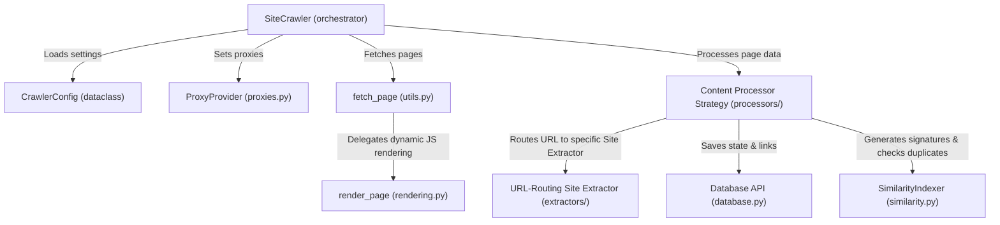

# C4 Model - Level 3: Component Diagram

The Component diagram shows the internal structure of the Python CLI Engine container and how components cooperate at runtime.

## ASCII Diagram

```text
+-------------------------------------------------------------------------------------+
| Container: Python CLI Engine                                                        |
|                                                                                     |
|   +-------------------+        Uses         +-----------------------+               |
|   |   SiteCrawler     +-------------------->|    CrawlerConfig      |               |
|   |  (Orchestrator,   |                     |  (Stores defaults &   |               |
|   |   Thread manager) |                     |   custom site flags)  |               |
|   +---------+---------+                     +-----------------------+               |
|             |                                                                       |
|             | Uses                                                                  |
|             v                                                                       |
|   +---------+---------+        Uses         +-----------------------+               |
|   |   ProxyProvider   +-------------------->|  fetch_page (utils)   |               |
|   |  (Direct, Tor,    |                     |  (requests Wrapper    |               |
|   |   Static Proxies) |                     |   with JS detection)  |               |
|   +-------------------+                     +-----------+-----------+               |
|                                                         |                           |
|                                                         | Delegates (if JS required)|
|                                                         v                           |
|                                             +-----------------------+               |
|                                             |    BrowserRenderer    |               |
|                                             |  (rendering.py -      |               |
|                                             |   Playwright/Selenium)|               |
|                                             +-----------+-----------+               |
|                                                         |                           |
|                                                         | Employs                   |
|                                                         v                           |
|   +-------------------+        Routes to    +-----------+-----------+               |
|   | Content Processors|<--------------------+  URL-routing Site     |               |
|   | (news, supermarket|                     |  Extractors (engines, |               |
|   |  forum packages)  |                     |  custom news extract) |               |
|   +---------+---------+                     +-----------------------+               |
|             |                                                                       |
|             +-----------------------+                                               |
|             | Calls                 | Calls                                         |
|             v                       v                                               |
|   +---------+---------+   +---------+---------+                                     |
|   |   Database API    |   | SimilarityIndexer |                                     |
|   |  (SQLite schemas, |   | (MinHash, Jaccard |                                     |
|   |   queries, queue) |   |  similarity check)|                                     |
|   +-------------------+   +-------------------+                                     |
+-------------------------------------------------------------------------------------+
```

## Mermaid Diagram



## Details & Description

### 1. SiteCrawler (`crawler_app.py`)
* Manages crawler runtime loop, thread execution (Producer/Consumer model), log initiation, and safe shutdown processes.

### 2. CrawlerConfig (`config.py`)
* Centralized dataclass encapsulating all execution parameters (crawl delay, respect robots, DB directory, logging paths, plagiarism parameters, and JS rendering parameters) with standard fallback values.

### 3. ProxyProvider (`proxies.py`)
* Factory provider representing direct connection, static proxies, or Tor proxy configuration strategies.

### 4. Fetch Page Helper (`utils.py`)
* Standard wrapper around the `requests` library implementing connection timeouts, exponential backoff retries, SSL verification, binary/text parsing, and JavaScript dependency auto-detection.

### 5. Browser Renderer (`rendering.py`)
* Unified browser controller wrapping Playwright, Selenium, and Puppeteer/Pyppeteer, providing fallback mechanisms to fetch pages requiring full JavaScript execution.

### 6. Extractor Strategy (`extractors/`)
* Contains modular URL-routing site-specific extractors (InfoExtractor Pattern) and core parser engine wrappers (newspaper, trafilatura, bs4). Exposes `get_site_extractor(url)` to retrieve domain-matched classes.

### 7. ContentProcessor Strategy (`processors/`)
* Implements Strategy Pattern to process page data. Contains `NewsContentProcessor` (parses, indexes similarity, checks plagiarism), `SupermarketContentProcessor` (parses catalogs and product pricing), and `ForumContentProcessor` (parses thread posts).

### 8. Database API (`database.py`)
* Interface mapping read/write operations to SQLite, handling thread-local connection pools, queue structures, and schema migrations.

### 9. SimilarityIndexer (`similarity.py`)
* Performs content deduplication and plagiarism checking. Calculates Jaccard similarity indices on MinHash signatures generated from document shingles.
