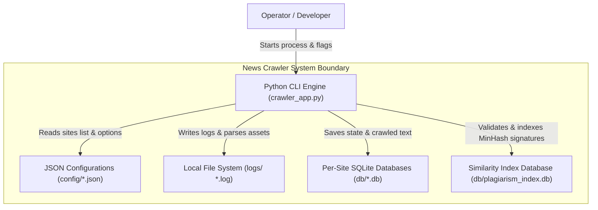

# C4 Model - Level 2: Container Diagram

The Container diagram shows the high-level shape of the software architecture, the distribution of responsibilities, and how containers communicate.

## ASCII Diagram

```text
+--------------------------------------------------------------------------------+
| Boundary: News Crawler System                                                  |
|                                                                                |
|  +---------------------------+              +-------------------------------+  |
|  |    Python CLI Engine      |  Configures  |      JSON Configurations      |  |
|  |  (argparse, orchestrator  +------------->|   (news-sites-gr.json, etc.)  |  |
|  |   multi-site feeds)       |              +-------------------------------+  |
|  +-------------+-------------+                                                 |
|                |                                                               |
|                | Reads/Writes                                                  |
|                v                                                               |
|  +-------------+-------------+                                                 |
|  |        File System        |                                                 |
|  |  (Stores log files,       |                                                 |
|  |   temp cache, etc.)       |                                                 |
|  +-------------+-------------+                                                 |
|                |                                                               |
|                | Reads/Writes                                                  |
|                v                                                               |
|  +-------------+-------------+              +-------------------------------+  |
|  |    SQLite Databases       |  Indexes     |  Similarity Index DB (SQLite) |  |
|  |   (per-domain database    +------------->|     (plagiarism_index.db)     |  |
|  |    e.g. protothema.db)    |  Signatures  +-------------------------------+  |
|  +---------------------------+                                                 |
+--------------------------------------------------------------------------------+
```

## Mermaid Diagram



## Details & Description

### 1. Python CLI Engine
* **Technology**: Python 3.x (Standard library, `requests`, `beautifulsoup4`, `trafilatura`, `newspaper3k`).
* **Responsibility**: Orchestrates crawls. If crawling multiple sites, spawns thread pools. Initiates requests, runs HTML extractors, generates MinHash signatures for plagiarism checks, and handles shutdown signals.

### 2. JSON Configurations
* **Technology**: JSON format files.
* **Responsibility**: Houses crawler targets and site-specific rules (respect_robots, crawl_delay, proxies, re-crawl intervals).

### 3. Local File System
* **Technology**: OS File System storage.
* **Responsibility**: Stores unstructured logs (`logs/crawler_<domain>_<datetime>.log`) for debugging and execution transparency.

### 4. Per-Site SQLite Databases
* **Technology**: SQLite 3.
* **Responsibility**: Keeps track of crawled data table (`crawled_data`) consisting of `link` status (pending/crawled), content hashes, dates crawled, raw html payloads, and article texts. Supports resuming and incremental crawl operations.

### 5. Similarity Index Database
* **Technology**: SQLite 3.
* **Responsibility**: A central index DB (`db/plagiarism_index.db`) holding `minhash_signatures` of all crawled articles across different sites. Used to identify near-duplicates and plagiarism matches using Jaccard similarity indices.
