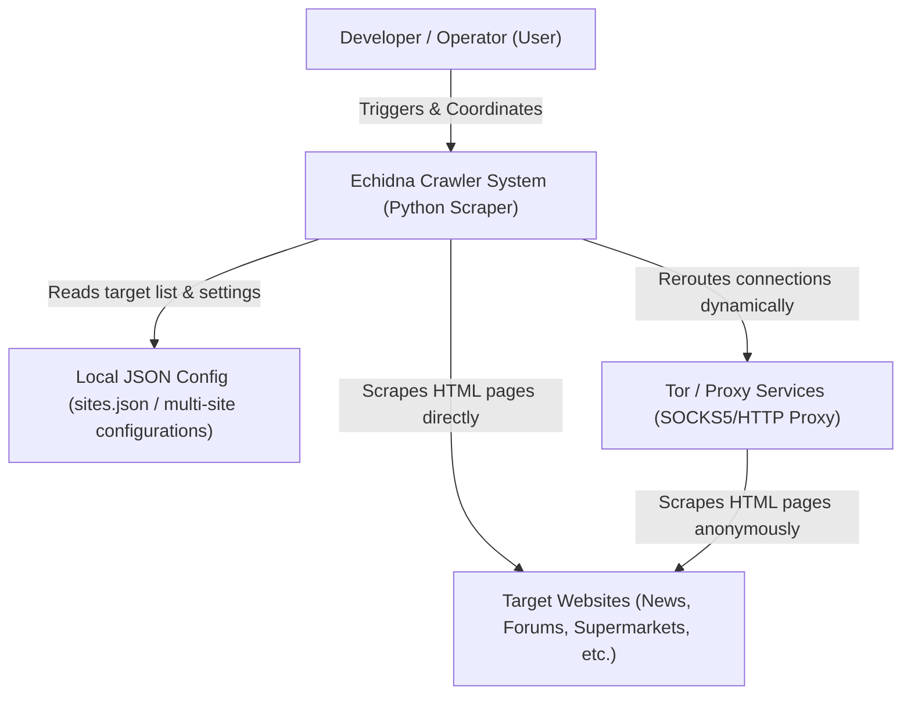

# C4 Model - Level 1: System Context Diagram

This diagram shows the Echidna Crawler system boundaries, the users/operators interacting with it, and the external dependencies or systems it communicates with.

## ASCII Diagram

```text
+---------------------------------------+
|              Developer /              |
|               Operator                |
|      (Runs CLI / Config crawls)       |
+-------------------+-------------------+
                    |
                    | Triggers
                    v
+-------------------+-------------------+
|                                       |
|        Echidna Crawler System         |  Reads settings
|     (Executes site scraping,          +------------------->  Local JSON Config
|      parses & stores content)         |                      (sites.json)
|                                       |
+---------+-------------------+---------+
           |                   |
           | Scrapes           | Reroutes (optional)
           v                   v
+---------+---------+   +-----+-------------+
| Target Websites   |   | Tor / Proxy       |
| (News, Forums,    |   | Services          |
|  Supermarkets)    |   | (IP Rotation)     |
+-------------------+   +-------------------+
```

## Mermaid Diagram



## Details & Description

### Users / Actors
* **Developer / Operator**: Triggers the crawler execution either via a single target URL (`--url`) or using parallel configurations (`--config`). They read log outputs and query the generated SQLite databases.

### Software System
* **Echidna Crawler System**: The core Python application (`crawler_app.py`). It orchestrates connection management, respects crawling rules (such as `robots.txt`), performs boilerplate removal and text/catalog extraction, flags near-duplicate content/articles, and stores structured content.

### External Dependencies & Systems
* **Local JSON Config**: Local configuration files containing target site urls, crawl delays, re-crawl times, and proxy preferences.
* **Target Websites**: Remote HTTP/HTTPS servers hosting target portals (news portals, supermarket catalogs, forums, etc.). These are scraped strictly following their `robots.txt` directives.
* **Tor / Proxy Services**: Services (e.g. SOCKS5h Tor wrapper or HTTP proxies) optional for connection routing, helping bypass rate-limits, prevent IP blocks, and ensure anonymity.
