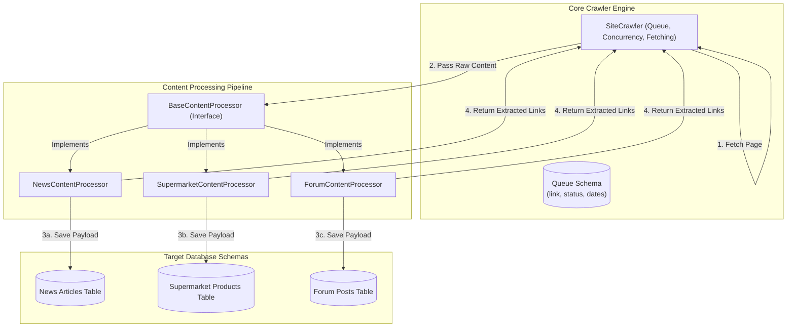

# Decoupling Crawler Engine from Domain-Specific Scraping (Supermarkets, Forums, etc.)

Currently, the `SiteCrawler` and `database.py` schemas are tightly coupled to news scraping (e.g., article titles, authors, text, plagiarism checking, and newspaper3k/trafilatura extractors). 

To extend the crawler for other websites like supermarkets or forums, we need to separate the **Queue & Fetching Engine** from the **Content Extraction & Processing Pipeline**.

---

## Decoupled Architecture Design

We propose separating the system into three decoupled layers:



---

## Detailed Components

### 1. The Core Queue Schema (`database.py`)
The crawler only needs to know about links, status (`pending`, `crawled`), and timestamps to manage the queue. The payload columns (`extracted_title`, `extracted_text`, etc.) will be removed from the core queue table:
```sql
CREATE TABLE crawl_queue (
    id            INTEGER PRIMARY KEY AUTOINCREMENT,
    domain        TEXT NOT NULL,
    link          TEXT NOT NULL UNIQUE,
    status        TEXT NOT NULL CHECK(status IN ('pending', 'crawled')),
    date_inserted DATETIME NOT NULL,
    date_crawled  DATETIME
);
```

### 2. The Content Processor Strategy Pattern
We will define an interface (abstract class) `BaseContentProcessor`. Each scraper type (news, supermarket, forum) will implement this interface:

```python
class BaseContentProcessor:
    """Strategy interface for processing crawled pages."""
    
    def process_page(self, crawler, url: str, content: str, content_type: str) -> tuple[bool, set[str], str]:
        """
        Process page content, perform custom parsing/extraction, save payload data, 
        and extract links for further crawling.
        
        Returns:
            tuple: (success_status, extracted_links, action_flag)
        """
        raise NotImplementedError
```

#### Example Implementation for News:
```python
class NewsContentProcessor(BaseContentProcessor):
    def process_page(self, crawler, url, content, content_type):
        # 1. Deduplicate by content hash
        # 2. Extract news metadata (using extractors.py)
        # 3. Check for plagiarism (using similarity.py)
        # 4. Save to news_articles table
        # 5. Return (True, extracted_links, None)
```

#### Example Implementation for Supermarkets:
```python
class SupermarketContentProcessor(BaseContentProcessor):
    def process_page(self, crawler, url, content, content_type):
        # 1. Parse product price, title, SKU, and category using custom supermarket parser
        # 2. Save product details to supermarket_products table
        # 3. Extract pagination and category links
        # 4. Return (True, extracted_links, None)
```

### 3. Coupling Changes in `SiteCrawler`
Inside `SiteCrawler.crawl_page()`:
```python
    # Fetch page
    content, content_type, error = fetch_page(url, ...)
    
    # Delegate parsing and storage completely to the content processor
    success, new_links, action = self.processor.process_page(self, url, content, content_type)
```

---

## Proposed Transition Plan

### Phase 1: Establish Base Class & News Strategy
1. Create `processors.py` and define `BaseContentProcessor` and `NewsContentProcessor`.
2. Move news extraction, deduplication, and plagiarism checks from `SiteCrawler` into `NewsContentProcessor`.

### Phase 2: Separate Crawler Queue DB from Payload DB
1. Refactor `database.py` to support a generic queue schema (`crawl_queue`).
2. Move the article-specific CRUD queries to `NewsContentProcessor` or database helper extensions.

### Phase 3: Add Support for Dynamic Supermarket / Forum Selection
1. Update `crawler_app.py` CLI and JSON config to accept a `--processor` parameter (e.g. `--processor news`, `--processor supermarket`).
2. Map the parameter to the appropriate class in a processor registry factory.
