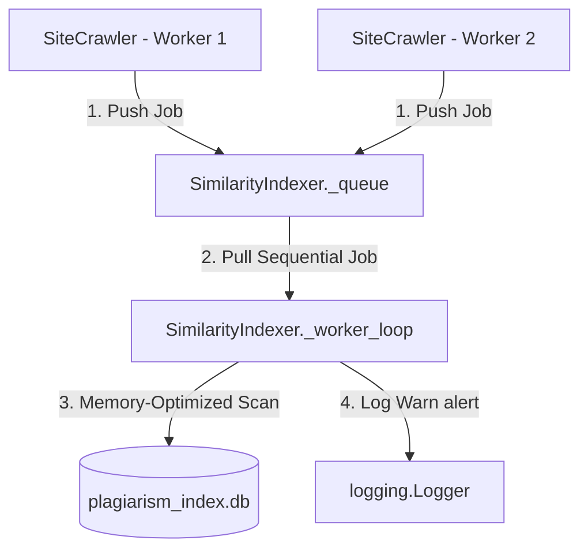

# Implementation Plan: Central Similarity DB Lock Contention Optimization

This plan outlines the architecture to decouple crawler workers from the central SQLite similarity index database (`plagiarism_index.db`). By introducing a background producer-consumer queue pattern, we isolate all SQLite read/write operations to a single worker thread, completely eliminating lock contention and maximizing page crawling throughput.

---

## User Review Required

> [!NOTE]
> All similarity checking and database inserts will occur asynchronously in a background queue. Crawler workers will push pages to the queue without waiting, increasing crawl throughput. Duplicate alert warnings (`🚨 Plagiarism/Duplicate Detected!`) will be logged in real-time by the background thread.

---

## Proposed Changes

We will introduce a thread-safe `queue.Queue` inside `SimilarityIndexer` and run a single background worker thread to process indexing sequentially. We will also implement a memory-optimized Jaccard scan query to minimize memory overhead.



### 1. [MODIFY] [similarity.py](file:///c:/Users/Stavros/workspace/GreekNewsScraper/Crawler.git/similarity.py)
* **Class-Level Thread Queue**: Define a static `_queue = queue.Queue()` and `_worker_thread = None` inside the `SimilarityIndexer` class.
* **Background Worker Thread Loop (`_worker_loop`)**:
  * Runs as a daemon thread.
  * Opens a single SQLite connection to the similarity database.
  * Processes jobs one by one, executing MinHash generation, Jaccard matching, and SQLite persistence.
  * **Memory Optimization**: Select only `url`, `domain`, `title`, `date_crawled`, and `text_signature` columns for comparison. Do not load large `html_content` and `extracted_text` strings into memory.
  * Logs matching warnings (`🚨 Plagiarism/Duplicate Detected!`) to the correct site logger.
* **`index_and_check()` Hook**:
  * Pushes crawling details (`url`, `domain`, `title`, `html_content`, `extracted_text`, etc.) into `_queue`.
  * Starts the daemon background thread if it is not already active.
* **`shutdown()` Hook**:
  * Pushes `None` to the queue to signal the worker thread to exit, and blocks using `_queue.join()` until all queued indexing tasks are completely written to disk.

### 2. [MODIFY] [crawler_app.py](file:///c:/Users/Stavros/workspace/GreekNewsScraper/Crawler.git/crawler_app.py)
* Wrap crawls in `main()` with a `try/finally` block.
* In the `finally` block, call `SimilarityIndexer.shutdown()` to ensure all queued similarity checking tasks finish persisting to the database before the process exits:
  ```python
  try:
      # Run crawls
  finally:
      print("Waiting for similarity indexing to complete...")
      from similarity import SimilarityIndexer
      SimilarityIndexer.shutdown()
  ```

---

## Verification Plan

### Automated Tests
Run syntax checks:
```bash
python -m py_compile similarity.py crawler_app.py
```

### Manual Verification
1. Run `python C:\Users\Stavros\.gemini\antigravity-ide\brain\533c086f-2b24-4f3f-b232-a770644c4151\scratch\test_similarity.py` to confirm thread-safety and queue joins work cleanly in unit tests.
2. Run a parallel crawl on multiple URLs and check that:
   * No `sqlite3.OperationalError: database is locked` contentions occur on the plagiarism database.
   * Near-duplicate warnings are logged correctly.
   * `plagiarism_index.db` holds all signatures and matches.
