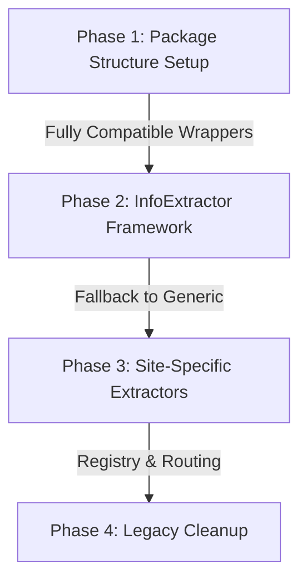

# Modular Directory Structure and InfoExtractor (URL Routing) Migration

This plan details a phased migration to refactor the crawler's directory layout and implement the `InfoExtractor` pattern (domain/URL routing) for news portals.

To ensure stability, **each phase maintains full backward compatibility** so the crawler can be run successfully at any time.

---

## Phased Approach

### Phase 1: Package Structure Setup
Create the new folder structure and relocate existing code without altering its logic. We will use legacy wrapper files to keep current imports working.

- Create `processors/` directory. Move the content processor classes from [processors.py](file:///c:/Users/Stavros/workspace/GreekNewsScraper/Crawler.git/processors.py) to separate files:
  - `processors/base.py`
  - `processors/news.py`
  - `processors/supermarket.py`
  - `processors/forum.py`
- Modify [processors.py](file:///c:/Users/Stavros/workspace/GreekNewsScraper/Crawler.git/processors.py) to act as a wrapper (importing and re-exporting the classes from the new package).
- Create `extractors/` directory. Move parser engine classes (Newspaper, Trafilatura, etc.) from [extractors.py](file:///c:/Users/Stavros/workspace/GreekNewsScraper/Crawler.git/extractors.py) to `extractors/engines.py`.
- Modify [extractors.py](file:///c:/Users/Stavros/workspace/GreekNewsScraper/Crawler.git/extractors.py) to act as a wrapper.

*Verification*: Run a test crawl using the existing setup to prove that the legacy wrappers work exactly as before.

---

### Phase 2: InfoExtractor Framework
Introduce the routing framework and the fallback extractor.

- Create `extractors/base.py` containing `BaseSiteExtractor` with:
  - `_VALID_URL` regex pattern.
  - `suitable(url)` classmethod for matching.
- Create `extractors/generic.py` containing `GenericExtractor`, which uses the existing library wrappers (`NewspaperExtractor` / `TrafilaturaExtractor`) to parse any website.
- Update `NewsContentProcessor` in `processors/news.py` to route URLs through a registry of site extractors, defaulting to the `GenericExtractor`.

*Verification*: Run the crawler and confirm that all news portals fallback to `GenericExtractor` and crawl successfully.

---

### Phase 3: Site-Specific Extractors
Implement custom extraction rules for target domains.

- Create `extractors/ertnews.py` with specific selectors for `ertnews.gr`.
- Create `extractors/kathimerini.py` with specific selectors for `kathimerini.gr`.
- Register these extractors in `extractors/__init__.py`.

*Verification*: Verify that when crawling ERT News or Kathimerini, the crawler routes them to their specialized extractors while routing other domains to the generic extractor.

---

### Phase 4: Legacy Cleanup
Once the directory structure is fully verified:

- Update main imports in `crawler_app.py` to import directly from `processors` and `extractors` packages.
- Delete the legacy wrapper files:
  - `processors.py`
  - `extractors.py`

---

## User Review Required

> [!NOTE]
> In Phase 1, we will keep existing files `processors.py` and `extractors.py` intact as redirects so that any existing scripts, tests, or imports continue to function normally.

Please review the proposed phases and click **Proceed** to start Phase 1.
