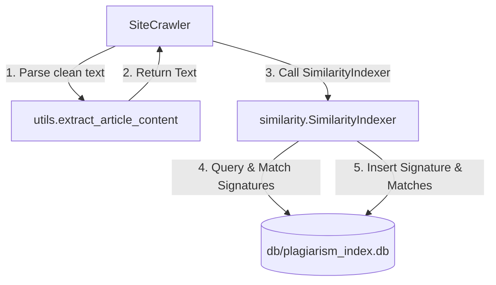

# Implementation Plan: Plagiarism & Near-Duplicate Content Detection (Phase 1)

Implement Phase 1 of the Plagiarism and Near-Duplicate Content Detection system. This will add a central SQLite database similarity index and use character 3-gram MinHash signatures to check for near-duplicate documents across all crawled domains in real-time.

---

## User Review Required

> [!NOTE]
> Database updates in this phase are applied to a new centralized database `db/plagiarism_index.db`. The domain-specific databases remain unchanged.

Based on feedback, the `global_signatures` table schema has been updated:
* Dates are configured as `DATETIME`.
* Added `date_inserted` tracking.
* Added `original_content` column to preserve the extracted clean article text.

---

## Proposed Changes

We will introduce a new module `similarity.py` to handle MinHash signatures and SQLite indexing, then hook it into the `SiteCrawler` lifecycle.



### 1. [NEW] [similarity.py](file:///c:/Users/Stavros/workspace/GreekNewsScraper/Crawler.git/similarity.py)
Create a new module containing:
* **Coefficient Initialization**: Deterministic coefficient parameters ($A$ and $B$, $K=128$) to simulate $128$ independent hash functions for MinHash.
* **`compute_minhash(text)`**: Tokenizes lowercased text into character 3-grams (shingles) and computes a 128-integer MinHash signature. Packed into a 512-byte `BLOB` for storage efficiency.
* **`calculate_similarity(sig1, sig2)`**: Computes the Jaccard similarity estimate by counting matching indices between two packed MinHash signature vectors.
* **`SimilarityIndexer` Class**:
  * Initializes `db/plagiarism_index.db` containing `global_signatures` and `plagiarism_matches` tables.
  * `index_and_check(url, domain, title, original_content, date_crawled, threshold)`: Loads existing signatures, compares them to detect matches, writes matches to `plagiarism_matches`, and inserts the new signature.

### 2. [MODIFY] [config.py](file:///c:/Users/Stavros/workspace/GreekNewsScraper/Crawler.git/config.py)
* Add global default configurations for plagiarism thresholds and index files:
  ```python
  PLAGIARISM_INDEX_DB = "db/plagiarism_index.db"
  PLAGIARISM_THRESHOLD = 0.8  # 80% similarity threshold
  ```

### 3. [MODIFY] [crawler_app.py](file:///c:/Users/Stavros/workspace/GreekNewsScraper/Crawler.git/crawler_app.py)
* Import `SimilarityIndexer` from `similarity`.
* Import `PLAGIARISM_INDEX_DB` and `PLAGIARISM_THRESHOLD` from `config`.
* Instantiate `self.indexer = SimilarityIndexer(PLAGIARISM_INDEX_DB, logger=self.logger)` during `SiteCrawler.initialize()`.
* In `SiteCrawler.crawl_page()`, after extracting clean text, call `self.indexer.index_and_check(...)`:
  ```python
  if extracted.get("text"):
      matches = self.indexer.index_and_check(
          url=current_url,
          domain=self.domain,
          title=extracted["title"] or "",
          original_content=extracted["text"],
          date_crawled=datetime.now(),
          threshold=PLAGIARISM_THRESHOLD
      )
      for match in matches:
          self.logger.warning(
              f"🚨 Plagiarism/Duplicate Detected! {current_url} is "
              f"{match['score']*100:.1f}% similar to {match['url']} ({match['title']})"
          )
  ```

---

## Verification Plan

### Automated Tests
Run syntax checks:
```bash
python -m py_compile config.py utils.py similarity.py crawler_app.py
```

### Manual Verification
1. Crawl two different test URLs containing nearly identical press releases or news text.
2. Verify that the logger prints `🚨 Plagiarism/Duplicate Detected!` warning.
3. Query `db/plagiarism_index.db` to check that the database exists and records signatures and matches:
   ```bash
   sqlite3 db/plagiarism_index.db "SELECT source_url, target_url, similarity_score FROM plagiarism_matches;"
   ```
