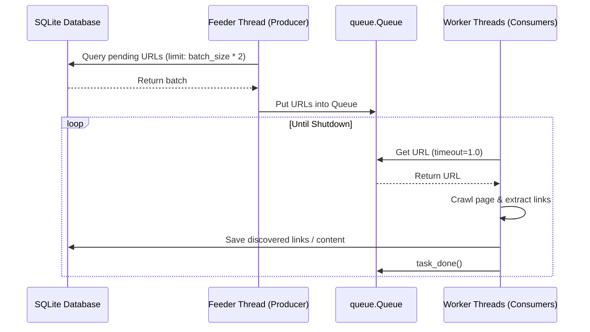

# Implementation Plan: Producer-Consumer Queue Model

Refactor the batch-based crawl executor loop in `SiteCrawler.crawl` to a continuous Producer-Consumer queue model. This resolves thread thrashing, removes the batch synchronization boundary (where slow requests stall all threads), and optimizes target site crawling throughput.

---

## Proposed Changes

We will modify `crawler_app.py` to decouple queue loading and task execution.



### 1. [MODIFY] [crawler_app.py](file:///c:/Users/Stavros/workspace/GreekNewsScraper/Crawler.git/crawler_app.py)

#### Add Queue Tracking Properties to `SiteCrawler.__init__`
* Define `self._queued_urls = set()`: Tracks URLs currently residing in the queue or in-flight to prevent duplicate ingestion by the feeder thread.
* Define `self._queue_lock = threading.Lock()`: Synchronizes access to `self._queued_urls`.

#### Implement Feeder Loop Method (`_feeder_loop`)
Create a background thread function that monitors the queue size:
* If the number of items in the queue falls below `self.batch_size`, query the next batch from SQLite.
* Filter loaded URLs against `self._queued_urls` to avoid overlapping.
* Populate the thread-safe `queue.Queue`.
* If no new pending URLs are found in the DB, and `self._queued_urls` is empty, crawling is complete. Trigger `self.shutdown_event.set()` to signal the termination of the crawler.
* Use `self.shutdown_event.wait(timeout=0.5)` to sleep efficiently and avoid busy-waiting.

#### Implement Worker Loop Method (`_worker_loop`)
Create the persistent worker loop function:
* Retrieve URLs from the queue using `q.get(timeout=1.0)`.
* Catch `queue.Empty` exceptions to check if `self.shutdown_event` has been set, permitting clean exit loops.
* Call `self.crawl_worker(url)`.
* In a `finally` block, discard the URL from `self._queued_urls` and call `q.task_done()`.

#### Refactor `SiteCrawler.crawl`
* Instantiate a thread-safe `queue.Queue(maxsize=self.batch_size * 2)`.
* Spawn the background `feeder_thread`.
* Spawn `self.workers` worker threads using a single `ThreadPoolExecutor` running `self._worker_loop`.
* Use `self.shutdown_event.wait()` in the main thread to block until the crawl is complete or SIGINT is received.

---

## Verification Plan

### Automated Verification
Run py_compile to ensure no syntax or module import errors:
```bash
python -m py_compile crawler_app.py
```

### Manual Verification
Execute a crawl to verify continuous execution:
```bash
python crawler_app.py --url https://www.rizospastis.gr --workers 4 --batch-size 10
```
Verify that:
1. Crawler worker threads do not pause or block synchronously between batches.
2. The crawler terminates automatically when all links have been visited.
3. Ctrl+C instantly sets the shutdown event, terminating all worker threads safely.
