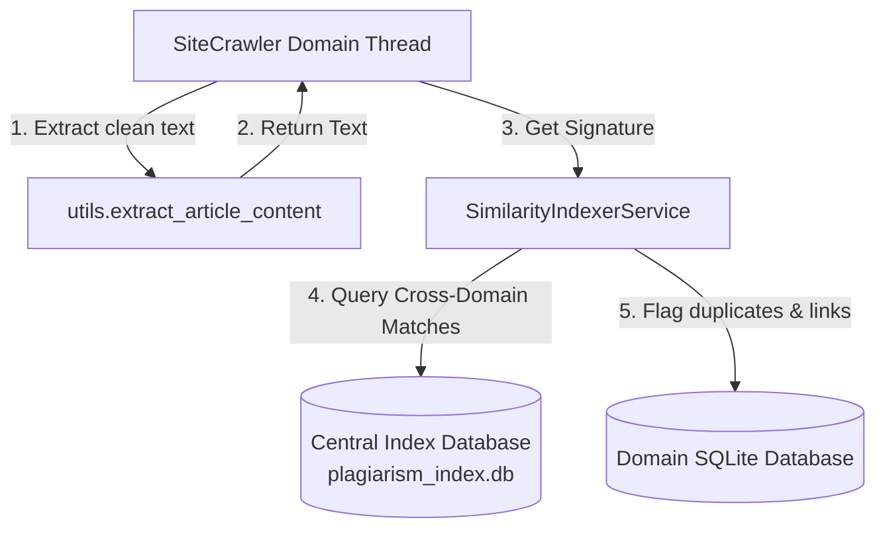

# Architectural Proposal: Plagiarism & Duplicate Content Detection

This document outlines how to integrate near-duplicate and plagiarism detection into the crawler's current Strategy Pattern and OOP-based architecture.

---

## 🎯 The Architectural Challenge
Currently, the crawler has **exact deduplication** (`UNIQUE` constraint on SHA-256 raw HTML hashes) and databases are **isolated per-domain** (`db/crawler_domain.db`).
To detect plagiarism or near-duplicates (e.g., rephrasing, copying news agency wires, or slight modifications):
1. We must compare **clean extracted text** (since boilerplate markup ruins similarity metrics).
2. We need a **cross-domain index** to compare articles across different websites.

---

## 🔍 Recommended Detection Techniques

Depending on performance requirements, three main approaches are viable:

```
┌────────────────────────────────────────────────────────┐
│  LIGHTWEIGHT: MinHash + LSH (Locality Sensitive)       │
│  - Best for: Copy-paste detection                      │
│  - Speed: Fast, simple bitwise comparisons             │
└──────────────────────────┬─────────────────────────────┘
                           ▼
┌────────────────────────────────────────────────────────┐
│  MEDIUM: TF-IDF + Cosine Similarity                    │
│  - Best for: Keyword overlap / thematic similarity      │
│  - Speed: Vector multiplications                       │
└──────────────────────────┬─────────────────────────────┘
                           ▼
┌────────────────────────────────────────────────────────┐
│  HEAVY: Multilingual Semantic Embeddings (Transformers)│
│  - Best for: Paraphrase, translation & semantic match  │
│  - Speed: Requires GPU/CPU inference models            │
└────────────────────────────────────────────────────────┘
```

---

## 🏛️ Proposed System Architecture

To implement this without breaking the existing parallel crawler performance, we should introduce a **Central Similarity Index** and a **Post-Crawl Matching Hook**.



### 1. The Central Database (`plagiarism_index.db`)
Create a single global database that stores lightweight signatures/hashes of all crawled articles.
```sql
CREATE TABLE global_signatures (
    id INTEGER PRIMARY KEY AUTOAccess,
    domain TEXT,
    url TEXT UNIQUE,
    title TEXT,
    date_crawled TEXT,
    text_signature BLOB -- MinHash signature array or Vector coordinates
);

CREATE TABLE plagiarism_matches (
    source_url TEXT,
    target_url TEXT,
    similarity_score REAL,
    match_type TEXT, -- 'near_duplicate', 'plagiarism'
    PRIMARY KEY (source_url, target_url)
);
```

### 2. The `SimilarityIndexer` Service
A new module `similarity.py` will manage signature calculations and queries:
```python
class SimilarityIndexer:
    def __init__(self, index_db_path="db/plagiarism_index.db"):
        self.db_path = index_db_path
        
    def compute_signature(self, text: str) -> bytes:
        # Computes MinHash signature or SentenceTransformer vector
        pass

    def find_matches(self, url: str, signature: bytes, threshold: float = 0.8) -> list:
        # Queries global_signatures table for matches above threshold
        pass
        
    def save_signature(self, url: str, domain: str, title: str, signature: bytes):
        # Inserts signature into central index
        pass
```

### 3. Integration in `SiteCrawler.crawl_page`
Once `extract_article_content` successfully retrieves the text, the crawler calls the indexer:
```python
# 1. Fetch & extract text
extracted = extract_article_content(...)

if extracted["text"]:
    # 2. Check similarities
    indexer = SimilarityIndexer()
    sig = indexer.compute_signature(extracted["text"])
    
    matches = indexer.find_matches(current_url, sig, threshold=0.8)
    for match in matches:
        # Log and store matching pairs in local database
        self.logger.warning(
            f"Plagiarism Detected! {current_url} matches {match['url']} "
            f"with {match['score']*100}% similarity."
        )
        save_plagiarism_match_in_local_db(self.database_name, current_url, match)
        
    # 3. Add to index
    indexer.save_signature(current_url, self.domain, extracted["title"], sig)
```

---

## 🚀 Implementation Phased Roadmap

* **Phase 1: MinHash + LSH (Near-Duplicate)**
  * Lightweight implementation using `datasketch` or basic Python MinHashing.
  * Captures rephrased copy-pasting of articles. Very fast SQLite binary signature scanning.
* **Phase 2: Central Index DB**
  * Introduce `plagiarism_index.db` with WAL mode enabled to support concurrent writes from parallel domain crawlers.
* **Phase 3: Vector Embeddings (Semantic Match)**
  * Add support for multilingual models (e.g., `paraphrase-multilingual-MiniLM-L12-v2`) to catch translated copy or heavily restructured sentences in Greek news outlets.
